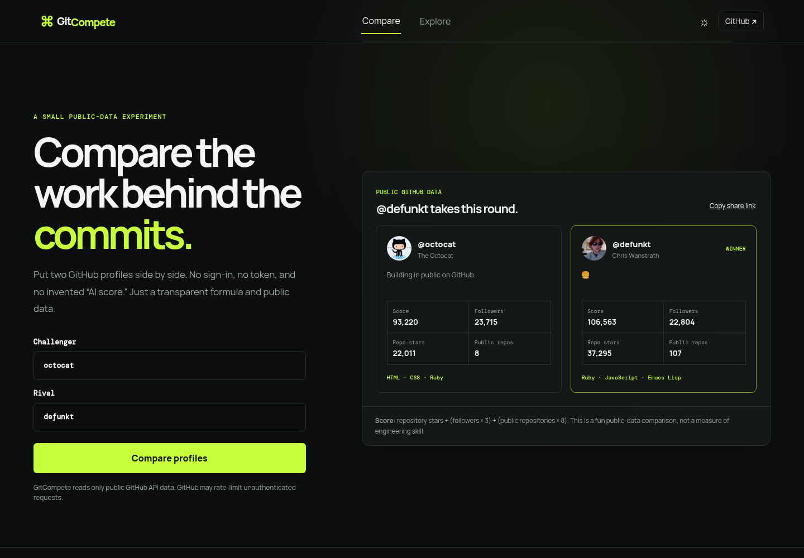

# GitCompete

GitCompete compares two **public** GitHub profiles with an intentionally visible scoring formula. It is a small frontend showcase built around a real external API, loading/error states, responsive layout, accessible controls, theme persistence, and shareable comparison URLs.



## Live site

After the Pages workflow deploys `master`: <https://piyush97.github.io/GitCompete/>

## What it does

- Compares followers, public repositories, total repository stars, and common repository languages.
- Uses the public GitHub REST API directly—no sign-in, backend, secret, or client ID required.
- Gives a transparent score: `repository stars + (followers × 3) + (public repositories × 8)`.
- Provides a repository explorer for a GitHub search query.
- Lets users copy a link such as `?challenger=torvalds&rival=gaearon` to reopen a comparison.

The score is deliberately a playful data visualization, **not** a judgment of engineering ability. Public GitHub data is incomplete and GitHub rate-limits unauthenticated clients.

## Run locally

```bash
npm install
npm run dev
```

Then open the URL Vite prints (normally `http://localhost:5173`).

```bash
npm test
npm run build
```

## Stack

- React 19 + Vite 7
- Native `fetch`, `URLSearchParams`, `navigator.clipboard`, and `localStorage`
- Node's built-in test runner for the scoring rule
- Static `dist/` output, ready for GitHub Pages, Vercel, or Netlify

## Why this architecture

The original project put a GitHub OAuth secret in browser code and depended on an obsolete Webpack/React stack. This version uses GitHub's unauthenticated public endpoints instead. That keeps the application deployable as a static site and, most importantly, means there is no browser-exposed secret to protect. A server-side token can be added later only if real users hit the public rate limit often enough to justify owning that operational responsibility.
